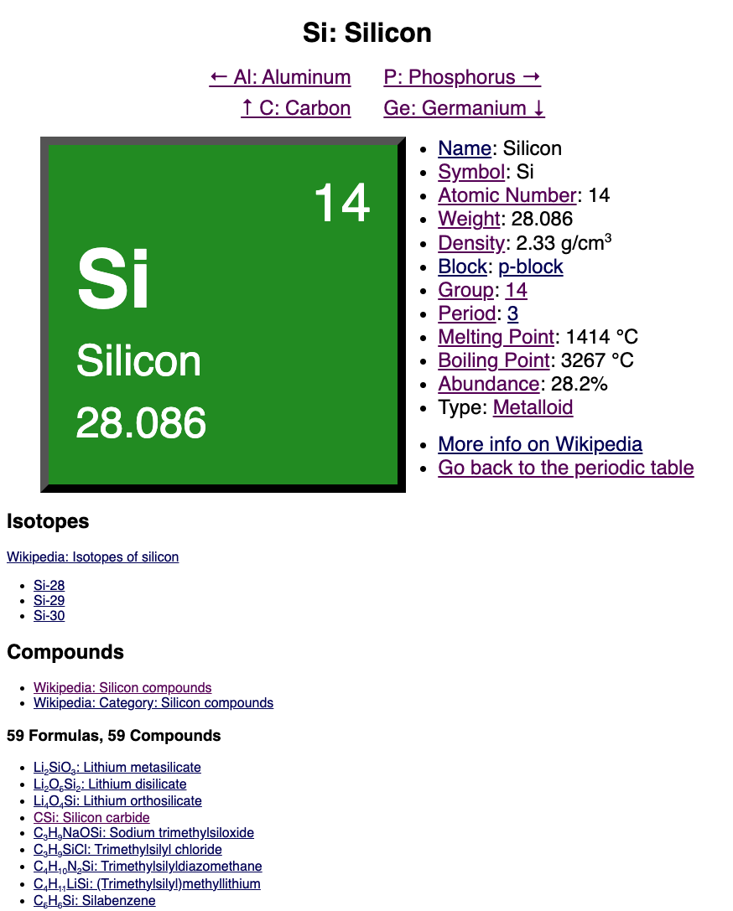

# Chemistry Explorer

This is a chemistry app built with vanilla JavaScript. It's an exercise to learn
web development fundamentals, using the simplest technology stack: plain HTML,
CSS, & client-side JS.

## Exercise Constraints
- No libraries, frameworks, templates, or preprocessors
- No server side processing (e.g. Node or Deno)
- No dev tools except Git, an editor, and a web browser

## Goals
- [x] Show the periodic table of the elements
- [x] Show details about each element
- [ ] Show info about simple chemicals (e.g. H2, H2O, NH3)

